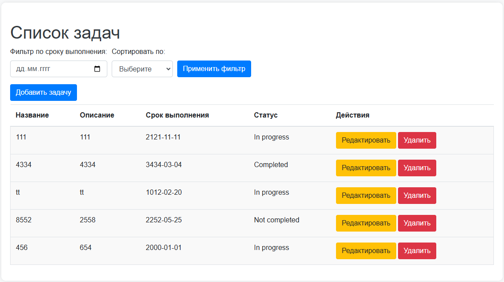
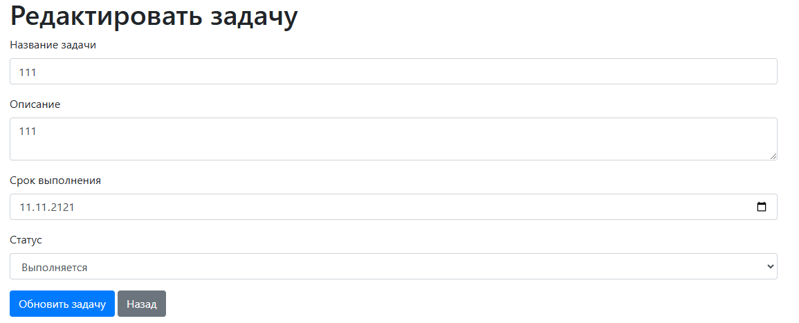
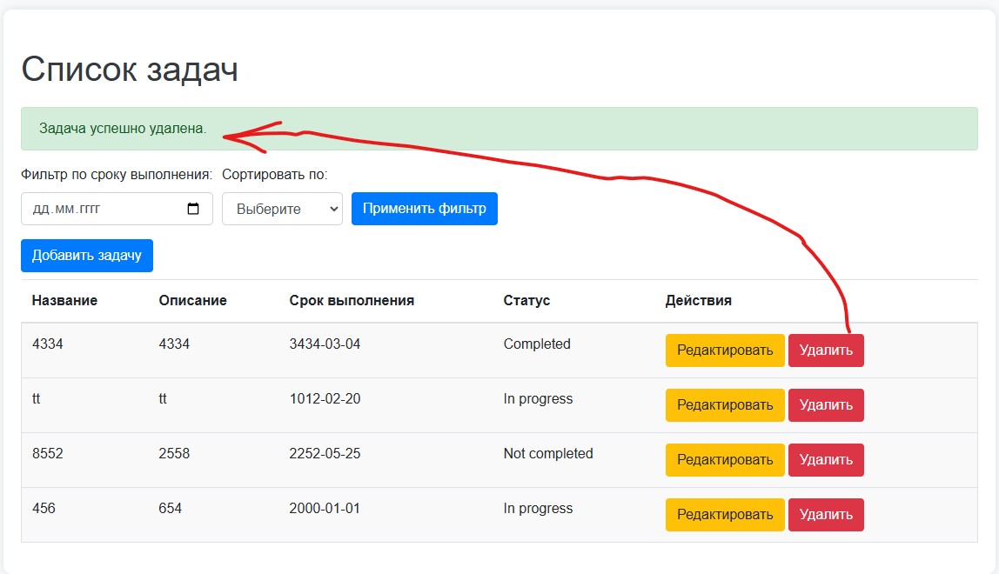
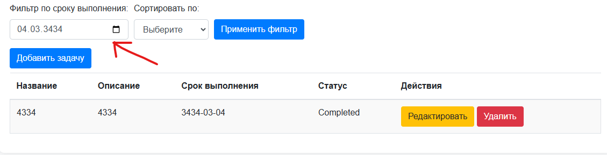

<p align="center"><a href="https://laravel.com" target="_blank"></a></p>
anya
<p align="center">
<a href="https://github.com/laravel/framework/actions"></a>
<a href="https://packagist.org/packages/laravel/framework"></a>
<a href="https://packagist.org/packages/laravel/framework"></a>
<a href="https://packagist.org/packages/laravel/framework"></a>
</p>

## About Laravel

# project

программы для запуска:
- php-8.1
- mysql-8.0.30
- nodejs-v20.14.0
- composer-2.4-dev

# Список задач 

## Описание проекта

Это приложение для управления задачами, позволяющее пользователям добавлять, редактировать, удалять и фильтровать свои задачи. Пользователи могут также сортировать задачи по статусу и сроку выполнения.

## Установка


1. Установить композер:
    ```
    composer install
    ```

2. 
    ```
    cp .env.example .env
    ```

3. Подключение к базе данных через `.env`:
   
    ```
    DB_CONNECTION=mysql
    DB_HOST=127.0.0.1
    DB_PORT=3306
    DB_DATABASE=laravel
    DB_USERNAME=root
    DB_PASSWORD=
    ```

4. Создание базы данных:
    ```
    php artisan migrate
    ```

5. Запустить сервер разработчика:
    ```
    php artisan serve
    ```

6. Ссылка для браузера:
    ```
    http://127.0.0.1:8000
    ```

## Основной функционал
### 1. Аутентификация 
Пользователь может зарегистрироваться и войти.


### 2.Загрузка файлов
Пользователи могут загружать файлы через удобную форму.
**Функционал**
Форма для загрузки файлов позволяет выбирать один или несколько файлов. После отправки формы файлы сохраняются на сервере с соответствующими метаданными (типы, размеры и т.д.)



### 3. Отображение файлов
После загрузки файлы отображаются в виде списка на главной странице.
**Как работает**
Загруженные файлы выводятся в виде таблицы или списка, где показываются название файла, дата загрузки, размер и статус.
Каждому файлу добавляется кнопка "Удалить", что позволяет пользователю удалить файл из системы.


### 4. Структура файлов
Реализована возможность создания папок для организации файлов.
**Как работает:**
Пользователь может создавать, переименовывать и удалять папки через интерфейс приложения. Все изменения отражаются в базе данных, и структура папок используется для категоризации файлов.


### 5. Работа с файлами
Пользователи могут скачивать файлы, а также просматривать изображения.

**Как работает:**
Скачивание: При клике на файл пользователю предлагается скачать его на устройство. Реализовано с помощью метода, ответственного за отправку файла в ответе.
Предварительный просмотр: Для изображений предусмотрена возможность предварительного просмотра. При клике на изображение оно открывается в модальном окне или новой вкладке.
## Эта функция отображакется на предыдущих скриншотах

### 6. необязательно по зпдпнию

### 7. Поиск
Реализована функция поиска файлов по имени.
**Как работает:**
Поле для поиска позволяет пользователю вводить текст. При отправке формы выполняется запрос к базе данных, возвращая файлы, соответствующие введенному критерию.

### 8. Теги
Пользователи могут тегировать файлы для улучшения организации.
**Как работает:**
При загрузке файла пользователь может добавить один или несколько тегов. Теги сохраняются в базе данных и могут использоваться для фильтрации файлов.

### 9. Перемещение файлов
Реализована возможность перемещения файлов между папками.
**Как работает:**
Пользователь выбирает файл и целевую папку. При подтверждении перемещения выполняется обновление записи в базе данных, и файл перемещается в выбранную папку.


Laravel is a web application framework with expressive, elegant syntax. We believe development must be an enjoyable and creative experience to be truly fulfilling. Laravel takes the pain out of development by easing common tasks used in many web projects, such as:

- [Simple, fast routing engine](https://laravel.com/docs/routing).
- [Powerful dependency injection container](https://laravel.com/docs/container).
- Multiple back-ends for [session](https://laravel.com/docs/session) and [cache](https://laravel.com/docs/cache) storage.
- Expressive, intuitive [database ORM](https://laravel.com/docs/eloquent).
- Database agnostic [schema migrations](https://laravel.com/docs/migrations).
- [Robust background job processing](https://laravel.com/docs/queues).
- [Real-time event broadcasting](https://laravel.com/docs/broadcasting).

Laravel is accessible, powerful, and provides tools required for large, robust applications.

## Learning Laravel

Laravel has the most extensive and thorough [documentation](https://laravel.com/docs) and video tutorial library of all modern web application frameworks, making it a breeze to get started with the framework.

You may also try the [Laravel Bootcamp](https://bootcamp.laravel.com), where you will be guided through building a modern Laravel application from scratch.

If you don't feel like reading, [Laracasts](https://laracasts.com) can help. Laracasts contains thousands of video tutorials on a range of topics including Laravel, modern PHP, unit testing, and JavaScript. Boost your skills by digging into our comprehensive video library.

## Laravel Sponsors

We would like to extend our thanks to the following sponsors for funding Laravel development. If you are interested in becoming a sponsor, please visit the [Laravel Partners program](https://partners.laravel.com).

### Premium Partners

- **[Vehikl](https://vehikl.com/)**
- **[Tighten Co.](https://tighten.co)**
- **[WebReinvent](https://webreinvent.com/)**
- **[Kirschbaum Development Group](https://kirschbaumdevelopment.com)**
- **[64 Robots](https://64robots.com)**
- **[Curotec](https://www.curotec.com/services/technologies/laravel/)**
- **[Cyber-Duck](https://cyber-duck.co.uk)**
- **[DevSquad](https://devsquad.com/hire-laravel-developers)**
- **[Jump24](https://jump24.co.uk)**
- **[Redberry](https://redberry.international/laravel/)**
- **[Active Logic](https://activelogic.com)**
- **[byte5](https://byte5.de)**
- **[OP.GG](https://op.gg)**

## Contributing

Thank you for considering contributing to the Laravel framework! The contribution guide can be found in the [Laravel documentation](https://laravel.com/docs/contributions).

## Code of Conduct

In order to ensure that the Laravel community is welcoming to all, please review and abide by the [Code of Conduct](https://laravel.com/docs/contributions#code-of-conduct).

## Security Vulnerabilities

If you discover a security vulnerability within Laravel, please send an e-mail to Taylor Otwell via [taylor@laravel.com](mailto:taylor@laravel.com). All security vulnerabilities will be promptly addressed.

## License

The Laravel framework is open-sourced software licensed under the [MIT license](https://opensource.org/licenses/MIT).
